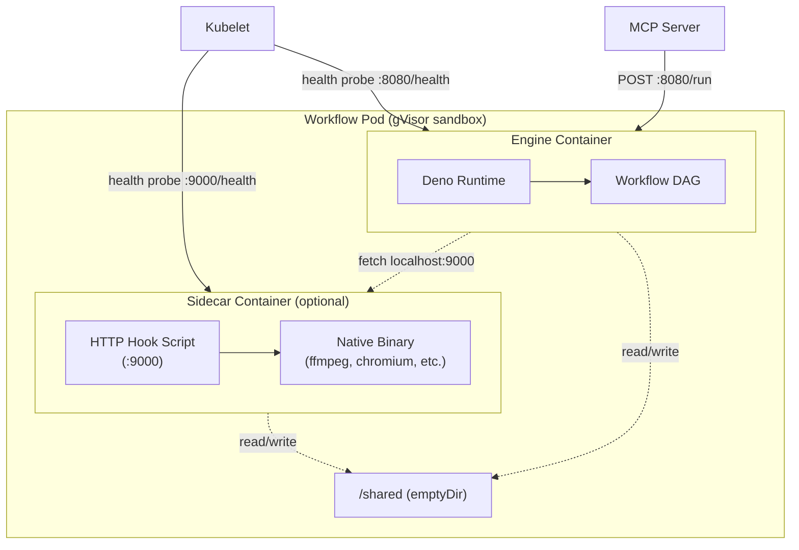

## System Overview

Tentacular is a workflow execution platform that runs TypeScript DAGs on Kubernetes with defense-in-depth sandboxing. The primary organizational unit is the **enclave** — a team-scoped workspace that binds a Slack channel, a Kubernetes namespace, shared infrastructure services (the exoskeleton), and team membership into a single governed unit.

Three components form the technical core: a Go CLI manages the full tentacle lifecycle, an in-cluster MCP server proxies all cluster operations through scoped RBAC, and a Deno engine executes workflow DAGs inside hardened containers with gVisor kernel isolation. The Kraken Slack bot is the primary human interface — teams interact through natural language in their Slack channel rather than the CLI directly.


**Request flow:**
```
Slack → The Kraken → MCP Server → Kubernetes (enclaves + tentacles)
                ↑
          tntc CLI (agents and operators)
```

**CLI-to-MCP Architecture:** The CLI has no direct Kubernetes API access. All cluster-facing commands (enclave provision/info/list/sync/deprovision, deploy, run, list, status, logs, undeploy, audit, cluster check, cluster profile) route through the MCP server using JSON-RPC 2.0 over Streamable HTTP. The MCP server is installed separately via its Helm chart.

| Directory | Purpose |
|-----------|---------|
| `cmd/tntc/` | CLI entry point (Cobra command tree) |
| `pkg/` | Go packages: spec parser, builder, K8s client, CLI commands |
| `engine/` | Deno TypeScript engine: compiler, executor, context, server, telemetry |
| `pkg/catalog/` | Catalog client for fetching tentacle templates |
| `deploy/` | Infrastructure scripts (gVisor installation, RuntimeClass) |

## Execution Isolation Model

Tentacular executes all nodes in a tentacle within a **single Deno process**. This architectural decision prioritizes simplicity and performance while maintaining strong pod-level security boundaries.

**Process model:**
- All nodes share the same Deno runtime and memory space
- Parallelism achieved via async/await and `Promise.all()`, not separate processes
- Isolation provided at the **pod level**, not per-node
- **Sidecars** run as additional containers in the same pod, sharing the network namespace and an optional `/shared` emptyDir volume

**Security boundaries (outer to inner):**
1. **Authorization:** MCP server evaluates owner/member/other permissions before executing tool operations (OIDC only; bearer tokens bypass)
2. **Pod-level:** gVisor syscall interception prevents container escape
3. **Container-level:** Kubernetes SecurityContext (non-root, read-only filesystem, dropped capabilities)
4. **Runtime-level:** Deno permission locking (allow-list for network, filesystem, write)
5. **Cluster-level:** Network policies, RBAC, and enclave-scoped namespace isolation

### Pod Structure

A workflow pod contains one engine container and zero or more sidecar containers. All containers share the pod's network namespace (localhost) and security context (gVisor, non-root, read-only root filesystem).



Sidecars enable workflows to use native binaries (ffmpeg, ImageMagick, Chromium, pandoc) without building custom images. Public Docker images are wrapped with lightweight HTTP servers injected via `command:`/`args:` in `workflow.yaml`. See the [Sidecars guide](/tentacular-docs/guides/sidecars/) for details.

## Go CLI Architecture

### Command Tree

```
tntc
├── enclave
│   ├── provision       Provision a new enclave (via MCP)
│   ├── info            Show enclave status and members (via MCP)
│   ├── list            List accessible enclaves (via MCP)
│   ├── sync            Update enclave membership or settings (via MCP)
│   └── deprovision     Permanently delete an enclave (via MCP)
├── scaffold
│   ├── list            List available scaffolds
│   ├── search          Search scaffolds by keyword
│   ├── info            Show scaffold details
│   ├── init            Create tentacle from scaffold (--enclave flag)
│   ├── extract         Extract scaffold from existing tentacle
│   ├── sync            Refresh public quickstart cache
│   └── params          Show/validate scaffold parameters
├── state
│   ├── init            Initialize git-backed state repo
│   ├── status          Show state repo status (dirty files, push status)
│   └── commit          Commit tentacle changes to state repo
├── secrets
│   ├── check           Validate secrets against contract
│   └── init            Initialize secrets structure
├── catalog
│   ├── list            List catalog entries (legacy)
│   ├── search          Search catalog (legacy)
│   ├── info            Show catalog entry (legacy)
│   └── init            Create from catalog (legacy)
├── validate [dir]      Validate workflow.yaml spec
├── dev [dir]           Local dev server with hot-reload
├── test [dir/node]     Run node or pipeline tests
├── build [dir]         Build container image
├── deploy [dir]        Deploy to Kubernetes via enclave (via MCP)
├── status <name>       Check deployment health (via MCP)
├── run <name>          Trigger a deployed tentacle (via MCP)
├── logs <name>         View tentacle pod logs (via MCP)
├── list                List deployed tentacles (via MCP)
├── undeploy <name>     Remove a deployed tentacle (via MCP)
├── audit <name>        Run security audit (via MCP)
├── cluster check       Preflight cluster validation (via MCP)
├── cluster profile     Cluster capability snapshot (via MCP)
├── configure           Set CLI configuration
├── login               Authenticate via OIDC Device Authorization Grant
├── logout              Clear stored credentials
├── whoami              Show current authenticated identity
├── visualize [dir]     Generate Mermaid DAG diagram
└── version             Show version info
```

## Deno Engine Architecture

### Startup Sequence

1. Parse CLI flags: `--workflow`, `--port`, `--secrets`, `--watch`
2. Load `workflow.yaml` into `WorkflowSpec`
3. Compile DAG using Kahn's algorithm into execution stages
4. Resolve secrets (cascade: explicit > `.secrets/` > `.secrets.yaml` > `/app/secrets`)
5. Load all node modules via dynamic import
6. Create base Context (fetch, log, config, secrets)
7. Start HTTP server on configured port
8. Start NATS triggers if queue triggers are defined
9. Register signal handlers (SIGTERM/SIGINT) for graceful shutdown

### Compilation Pipeline

The compiler transforms a `WorkflowSpec` into a `CompiledDAG` with execution stages:

1. **Spec validation** — verify required fields (`name`, `nodes` with at least one entry, `edges`)
2. **Edge validation** — verify all references point to defined nodes, detect self-loops
3. **Topological sort** — Kahn's algorithm with deterministic ordering
4. **Stage grouping** — nodes grouped by dependency depth; same-stage nodes run in parallel

```
workflow.yaml edges:        Compiled stages:
  fetch → transform         Stage 1: [fetch]
  fetch → enrich            Stage 2: [enrich, transform]  (parallel)
  transform → notify        Stage 3: [notify]
  enrich → notify
```

### Execution Model

- **Stages execute sequentially** — each stage waits for the previous to complete
- **Nodes within a stage execute in parallel** — via `Promise.all()`
- **Timeout** — per-node timeout with `Promise.race` (default 30s)
- **Retry** — exponential backoff: 100ms, 200ms, 400ms... up to `maxRetries`
- **Fail-fast** — if any node in a stage fails, execution stops immediately
- **Telemetry** — `node-start`, `node-complete`, and `node-error` events fire into the TelemetrySink

### Context System

Each node receives a `Context` object:

```typescript
interface Context {
  dependency(name: string): DependencyConnection;
  log: Logger;
  config: Record<string, unknown>;
  fetch(service: string, path: string, init?: RequestInit): Promise<Response>;  // legacy
  secrets: Record<string, Record<string, string>>;  // legacy
}
```

- **`ctx.dependency(name)`** — primary API for accessing declared contract dependencies
- **`ctx.log`** — structured logging with node ID prefix
- **`ctx.config`** — workflow-level config from the `config:` block

## Data Flow


### Example: github-digest

```yaml
name: github-digest
version: "1.0"
triggers:
  - type: manual
nodes:
  fetch-repos:
    path: ./nodes/fetch-repos.ts
    description: "Fetches recent repos from GitHub API"
  summarize:
    path: ./nodes/summarize.ts
    description: "Produces a text summary of repo activity"
  notify:
    path: ./nodes/notify.ts
    description: "Sends the summary via configured notification channel"
edges:
  - from: fetch-repos
    to: summarize
  - from: summarize
    to: notify
```

Compiles to:
- **Stage 1:** `[fetch-repos]` — fetches GitHub repos
- **Stage 2:** `[summarize]` — receives repos array, produces summary text
- **Stage 3:** `[notify]` — receives summary, sends notification

## Triggers

| Type | Mechanism | Required Fields | Status |
|------|-----------|----------------|--------|
| `manual` | MCP server POSTs via K8s API service proxy | none | Implemented |
| `cron` | MCP server internal scheduler reads annotation, calls `wf_run` | `schedule`, optional `name` | Implemented |
| `queue` | NATS subscription triggers execution | `subject` | Implemented |
| `webhook` | Future: gateway to NATS bridge | `path` | Roadmap |

Cron schedules are stored in a `tentacular.io/cron-schedule` annotation on the Deployment. The MCP server's internal cron scheduler fires HTTP POST to the tentacle's `/run` endpoint on schedule — no CronJob resources are created.

## Enclave Architecture

An enclave is the primary organizational unit. Each enclave maps 1:1 to a Kubernetes namespace but surfaces as a team workspace rooted in a Slack channel. The enclave lifecycle drives the provisioning and teardown of all associated resources.

```
Enclave = Slack channel
        + Kubernetes namespace
        + Exoskeleton services (Postgres, RustFS, optionally NATS/SPIRE)
        + Team membership (owner + registered members)
        + POSIX permission policy
```

### Enclave Lifecycle

```
provision → active → frozen → deprovision
```

| State | What Can Happen |
|-------|-----------------|
| **Provisioning** | Namespace, exoskeleton services, RBAC, network policies, and resource quota are being created. Completes in seconds. |
| **Active** | Normal operation. Members deploy tentacles, run them, and iterate. Cron triggers fire. |
| **Frozen** | Triggered when the Slack channel is archived. Running tentacles continue, but no new deployments are allowed and cron triggers are paused. Unarchiving the channel unfreezes the enclave. |
| **Deprovisioned** | All tentacles stopped, all exoskeleton services cleaned up, namespace deleted. Irreversible. |

### Exoskeleton (Auto-Provisioned)

Every enclave is provisioned with a baseline set of shared infrastructure services called the exoskeleton. Services are scoped to the enclave — tentacles in one enclave cannot access exoskeleton resources from another.

| Service | Scope | Notes |
|---------|-------|-------|
| **Postgres** | One database per enclave, one schema per tentacle | Tentacles in the same enclave share the database server but have isolated schemas |
| **RustFS (S3-compatible)** | One bucket per enclave, one prefix per tentacle | Files are shared across tentacles within the enclave |
| **NATS** | Optional. One subject hierarchy per enclave | Auto-provisioned when a tentacle contract declares a NATS dependency |
| **SPIRE** | Optional. One trust domain per enclave | Auto-provisioned when a tentacle contract declares an identity dependency |

## Multi-Tenancy and Access Control

Tentacular is a multi-tenant platform. Multiple teams share a single Kubernetes cluster, each owning an enclave and the tentacles deployed within it. Access control follows an AAA (Authentication, Authorization, Accounting) framework:

- **Authentication** — users authenticate via Keycloak (OIDC) with brokered identity providers (Google SSO, GitHub). JWTs carry identity (`sub`, `email`). Slack channel membership provides the group model — IdP group claims are not used for authorization. Bearer tokens provide an admin/automation bypass path.
- **Authorization (RBAC)** — the MCP server enforces a POSIX-like permission model. Enclaves act as tenant boundaries (directories) and tentacles are resources within them (files). Both carry owner/member/other and mode attributes. The MCP server evaluates two permission layers on every OIDC request: enclave check then tentacle check.
- **Accounting** — Kubernetes annotations record ownership, provenance, and update history on every resource. Structured slog audit logging captures every authorization decision.

| Permission | Bit | Operations |
|------------|-----|------------|
| Read (r) | 4 | `wf_list`, `wf_status`, `wf_describe`, `wf_health`, `wf_logs`, `wf_pods`, `wf_events` |
| Write (w) | 2 | `wf_apply`, `wf_remove`, `enclave_sync` |
| Execute (x) | 1 | `wf_run`, `wf_restart` |

**Bearer-token bypass:** When the MCP server authenticates a request via bearer token (no OIDC identity), authorization is bypassed entirely. This is the operator/automation escape hatch.

See the [Enclave Concepts](/tentacular-docs/concepts/enclaves/) page and the [Multi-Tenancy and Access Control guide](/tentacular-docs/guides/authorization/) for the full AAA framework, RBAC details, presets, and CLI commands.

## Generated Kubernetes Resources

| Resource | Name | Purpose |
|----------|------|---------|
| ConfigMap | `{name}-code` | workflow.yaml + nodes/*.ts (max 900KB) |
| ConfigMap | `{name}-import-map` | deno.json import map with proxy rewrites |
| Deployment | `{name}` | 1 replica, gVisor, security contexts, probes |
| Service | `{name}` | ClusterIP, port 8080 |
| Secret | `{name}-secrets` | Opaque, from .secrets/ or .secrets.yaml |
| NetworkPolicy | `{name}` | Default-deny + contract-derived egress |
| emptyDir | `/tmp` (per container) | Writable scratch space for each container |
| emptyDir | `/shared` | Shared volume between engine and sidecars (when sidecars declared) |

When sidecars are declared in `workflow.yaml`, the builder adds additional containers to the Deployment spec, each with their own `/tmp` emptyDir, resource limits, health probes on `healthPath`, and the shared `/shared` volume mount. The engine's Deno `--allow-net` flags are extended to include sidecar ports (`localhost:<port>`).

## Extension Points

- **Adding a CLI command:** Create `pkg/cli/mycommand.go`, register in `cmd/tntc/main.go`
- **Adding a tentacle node:** Create `nodes/my-node.ts` with default async export, add to workflow.yaml, create test fixture
- **Adding a trigger type:** Extend `validTriggerTypes`, implement in builder or engine triggers
- **Adding a preflight check:** Add logic in `tentacular-mcp/pkg/k8s/preflight.go`
