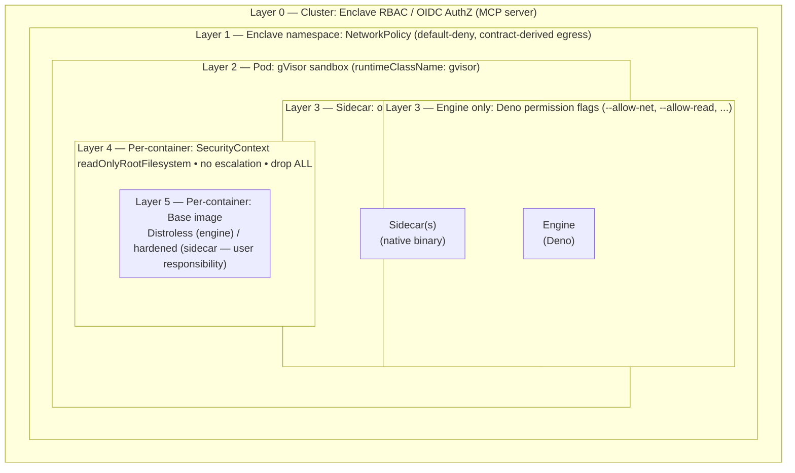

## Contract-Driven Security

The workflow contract is the central design primitive and the enforceable security policy. A single `contract.dependencies` block in the workflow YAML declares every external service a tentacle needs — protocol, host, port, and authentication type. From this one declaration, the system automatically derives multiple independent security layers.

### What the Contract Drives

- **Deno runtime permissions** — The TypeScript engine is locked to `--allow-net=<declared hosts:ports>` only. No undeclared network access is possible at the runtime level.
- **Kubernetes NetworkPolicy** — Default-deny ingress/egress is applied to every enclave namespace. Egress rules are generated per-dependency (HTTPS on :443, PostgreSQL on :5432, NATS on :4222, etc.). Only declared destinations are reachable at the network level.
- **Secrets validation** — Every secret referenced in the contract must exist in the secrets file before deployment proceeds. No dangling references, no missing credentials at runtime.
- **Dynamic targets** — For dependencies resolved at runtime (e.g., RSS feeds from multiple hosts), the contract supports CIDR-based rules with explicit port constraints, providing controlled flexibility without opening the network wide.

The contract is not documentation — it is the enforceable security policy. An agent authors a contract, and the platform enforces it at multiple independent layers. There is no way to access a resource that wasn't declared, even if the node code attempts to.

## Five Layers of Defense-in-Depth

Security boundaries from innermost to outermost. Layers are designed so that sidecars — additional containers for native binary capabilities — inherit pod-scoped protections (Layers 1–3) automatically, while per-container restrictions (Layers 4–5) are applied identically to every container in the pod.



| Layer | Scope | Mechanism | Sidecar Coverage |
|-------|-------|-----------|-----------------|
| 0 | Cluster | Enclave RBAC / OIDC (MCP server) | No change — sidecar containers are not accessible from outside the pod |
| 1 | Enclave namespace | NetworkPolicy | Covers all containers — sidecar external access requires a contract dependency |
| 2 | Pod | gVisor (`runtimeClassName`) | `runtimeClassName` is pod-level — all containers including sidecars run under gVisor |
| 3 | Per-container | Deno flags (engine) / own runtime (sidecar) | Engine-specific; sidecars run their own runtime but are constrained by Layers 1, 2, and 4 |
| 4 | Per-container | SecurityContext | Identical restrictions: `readOnlyRootFilesystem`, no escalation, `drop: ALL` applied to every container |
| 5 | Per-container | Base image | Distroless for engine; sidecar base image is user-selected — see [Sidecar Image Trust](#sidecar-image-trust) |

### Layer 1: Distroless Base Image (Engine)

The engine container uses `denoland/deno:distroless` — no shell, no package manager, no debugging tools. Attack surface is limited to the Deno runtime binary.

Sidecar images are user-specified. See [Sidecar Image Trust](#sidecar-image-trust).

### Layer 2: Deno Permission Locking (Engine)

When a tentacle declares `contract.dependencies`, the K8s Deployment manifest overrides the ENTRYPOINT with scoped flags. The `DeriveDenoFlags()` function generates:

```
--allow-net=api.openai.com:443,hooks.slack.com:443,localhost:9000,0.0.0.0:8080
--allow-read=/app,/var/run/secrets,/shared
--allow-write=/tmp,/shared
--allow-env=DENO_DIR,HOME,TELEMETRY_SINK
```

When sidecars are declared, `localhost:<PORT>` is automatically added to `--allow-net` for each sidecar. No subprocess, FFI, or unrestricted file system access beyond the declared paths.

Sidecar containers run their own runtime (Python, Node, a compiled binary) — not Deno. Deno permission locking does not apply to them. They are constrained instead by Layers 1, 3, and 4.

### Layer 3: gVisor Sandbox

Pods run with `runtimeClassName: gvisor`. gVisor intercepts syscalls via its application kernel (Sentry), preventing direct host kernel access. Even if a container escape is achieved, the attacker lands in gVisor's sandbox, not the host.

gVisor provides **pod-level isolation**. All containers in the pod — engine and every sidecar — share this gVisor boundary. Sidecars inherit gVisor protection automatically with no additional configuration.

:::note
Validated in production on ARM64 (k0s v1.34.2): `linuxserver/ffmpeg` under gVisor passes all PSA restricted checks with no ENOSYS errors.
:::

### Layer 4: Kubernetes SecurityContext

```yaml
automountServiceAccountToken: false  # No SA token exposed

securityContext:                    # Pod level — applies to all containers
  runAsNonRoot: true
  runAsUser: 65534                  # nobody
  seccompProfile:
    type: RuntimeDefault

securityContext:                    # Container level — applied to engine AND every sidecar
  readOnlyRootFilesystem: true
  allowPrivilegeEscalation: false
  capabilities:
    drop: ["ALL"]
```

The service account token is not mounted, preventing compromised pods from authenticating to the K8s API. The builder automatically provisions a per-container `/tmp` emptyDir for each sidecar (required when `readOnlyRootFilesystem: true` — many native tools write temp files).

### Layer 5: Network Policy

Default-deny ingress and egress is applied to every enclave namespace. Egress rules are generated per-dependency from the contract — for user-declared dependencies, the CLI derives the rules; for exoskeleton dependencies (`tentacular-*`), the MCP server automatically patches the NetworkPolicy with the correct egress rules at deploy time. Only declared destinations are reachable. Control-plane ingress from the MCP server is allowed for trigger execution. DNS egress to CoreDNS is always permitted.

**Sidecar network access:** Sidecars can only reach external hosts if the workflow contract includes a dependency for that host. A sidecar that needs to download ML models at startup must have a corresponding entry in `contract.dependencies`. Without it, NetworkPolicy blocks the egress traffic.

## Sidecar Image Trust

Sidecar containers run arbitrary Docker images. Tentacular does not curate or scan these images. The security of a sidecar is only as strong as the image it runs.

:::caution
A compromised sidecar container has the same network access as the engine (per NetworkPolicy), access to the `/shared` volume, and runs under the same uid. Treat sidecar image selection with the same rigor as first-party code.
:::

Recommendations:

- **Pin to a digest, not a tag.** Tags are mutable; digests are not. `image: org/ffmpeg-sidecar@sha256:abc123...` ensures the image cannot change under you.
- **Use minimal base images.** Prefer `python:3.12-slim` + static binary over full OS images. Smaller images have fewer packages and smaller attack surfaces.
- **Build your own production images.** Community images like `linuxserver/ffmpeg` are appropriate for development. For production, build a custom image with only the binary you need. See `scratch/native-code-research/RECOMMENDATION.md` for the ffmpeg production image recipe.
- **Scan images before use.** Use `trivy`, `grype`, or your CI scanner on custom images before deploying.

## Secrets Model

Secrets are mounted as **read-only files** at `/app/secrets` from a K8s Secret resource. They are never exposed as environment variables — env vars are visible in `kubectl describe pod`, process listings, and crash dumps.

See [Secrets guide](/tentacular-docs/guides/secrets/) for the full cascade and provisioning model.

## ESM Module Proxy

Nodes cannot access public TypeScript module repositories. All imports route through a local, in-cluster ESM module proxy (`esm.sh` via the `tentacular-support` namespace). This:

- Prevents supply-chain attacks via compromised modules
- Enables package pinning and version control
- Sets the stage for air-gapped deployment in the future

## Multi-Tenancy and Enclave-Based RBAC

When multiple teams share a Kubernetes cluster, contract-driven sandboxing protects tentacles from the outside world — but it doesn't control which *users* can access which *tentacles*. That's where enclaves and RBAC come in.

Tentacular implements a POSIX-like permission model where enclaves are directories and tentacles are files. Every enclave and every tentacle has an **owner**, a **member** set (registered enclave members), and an **other** class (any other authenticated user), with a mode string (e.g., `rwxrwx---`) controlling read, write, and execute access for each.

The group model comes from Slack channel membership — not from IdP groups. Keycloak provides authentication (identity) only; Slack channel membership determines authorization (who is a member of which enclave). This eliminates dependency on enterprise directory structures and lets teams be self-service.

### The AAA Framework

- **Authentication** — OIDC via Keycloak (with brokered IdPs like Google SSO). JWT carries cryptographic identity (`sub`, `email`). Bearer-token path for admin/automation.
- **Authorization** — Two-layer RBAC enforcement at the MCP server. Enclave permissions gate access to the tenant boundary; tentacle permissions gate individual resources. Five presets from `private` (owner-only) to `open-run` (visitors can view and trigger).
- **Accounting** — Every deploy stamps identity (who, when, via which agent). Every permission change is auditable through Kubernetes annotations. Structured logging captures every authorization decision.

### Two-Layer Check

The MCP server evaluates two permission layers on every OIDC request:

1. **Enclave check** — does the caller have the required permission on the enclave?
2. **Tentacle check** — does the caller have the required permission on the specific tentacle?

Both must pass. The enclave owner is a superuser within their enclave — they can perform any operation on any tentacle regardless of individual tentacle permissions.

### Permission Principals

| Principal | Who |
|-----------|-----|
| **Owner** | The Slack channel owner who provisioned the enclave, or the user who deployed a specific tentacle |
| **Member** | Registered enclave members — users who joined the Slack channel and completed OIDC sign-in |
| **Other** | Any other authenticated user — visitors who are not the owner or a registered member |

IdP group membership (Keycloak groups) is not used for authorization. Enclave membership is derived from Slack channel membership only.

### How It Integrates with Defense-in-Depth

Multi-tenancy adds a **Layer 0** to the defense-in-depth model above. Before a tentacle's contract-driven sandboxing even comes into play, the RBAC layer determines whether the caller is allowed to see, modify, or execute the tentacle at all. The layers work independently — a user who passes the RBAC check still faces all five sandbox layers.

For the full permission model, evaluator rules, CLI commands, and Kubernetes admin guide, see the [Multi-Tenancy and Access Control guide](/tentacular-docs/guides/authorization/).

## Audit Capabilities

`tntc audit <name>` runs three security checks via the MCP server:

- **RBAC audit** — verifies the tentacle's service account has minimal permissions
- **NetworkPolicy audit** — verifies default-deny is in place with contract-derived rules
- **PSA audit** — verifies Pod Security Admission labels are set to `restricted`

## Why This Matters for Agents

Agents creating and deploying code present unique security challenges. Without a structured security model:

- Prompt injection could cause an agent to write code that accesses unauthorized resources
- Data exfiltration through seemingly innocent network calls becomes trivial
- There's no way to audit what a deployed workflow is permitted to do

The contract model means that even if an agent is compromised, the deployed tentacle can only do what the contract declares. The straight jacket is applied at deployment time and cannot be modified at runtime.
