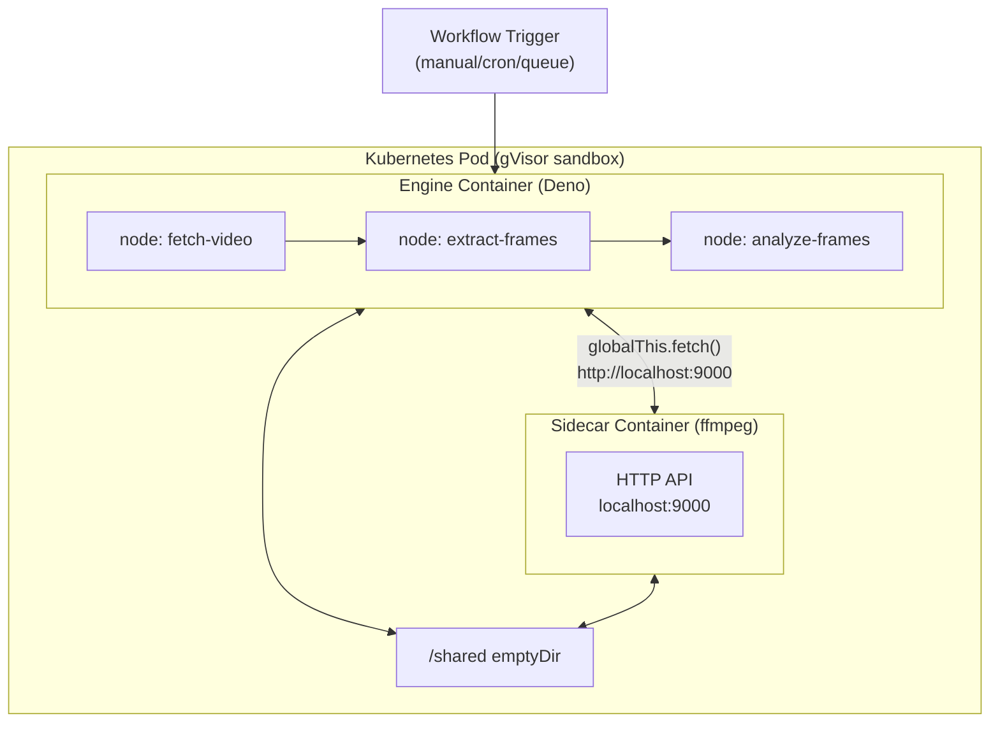
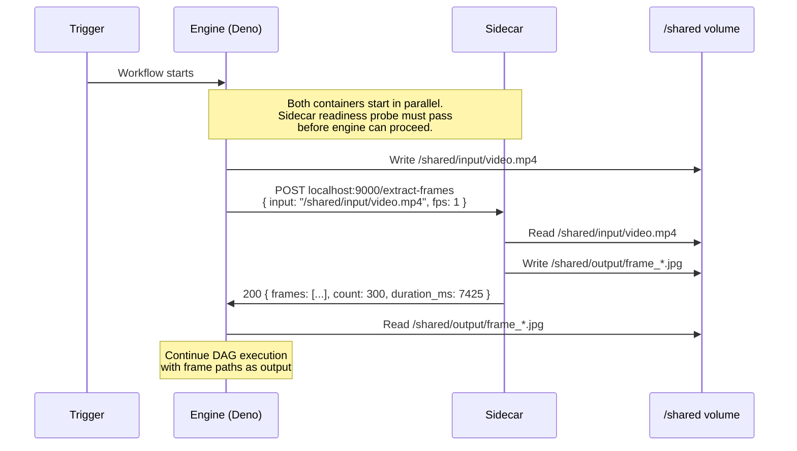

Tentacular's workflow engine runs TypeScript in a Deno sandbox. That covers most use cases, but some problems require native binaries — video transcoding at 40x realtime, headless browser rendering, ML model inference. Sidecars solve this by running an additional container in the same pod, reachable over `localhost`, with no changes to the engine architecture.

## How It Works

When you declare a `sidecars:` block in `workflow.yaml`, the builder generates a multi-container Kubernetes Deployment. All containers share the same pod:

- The **engine container** runs your Deno workflow nodes
- Each **sidecar container** runs a native binary wrapped with an HTTP API
- They communicate over `localhost:PORT` — no network policy, no service, no DNS
- Files are exchanged through a `/shared` emptyDir volume mounted in both containers



The gVisor sandbox boundary covers all containers in the pod. SecurityContext restrictions (`readOnlyRootFilesystem`, `runAsNonRoot`, `drop: ALL`) are applied identically to every container.

## When to Use Sidecars

| Requirement | Sidecar | WASM | Init Container |
|-------------|---------|------|----------------|
| Native binary, any Docker image | Yes | No | Yes |
| Multiple calls per workflow run | Yes | Yes | No (one-shot) |
| Large files (video, images, docs) | Yes | Limited | Yes |
| CPU-bound processing at speed | Yes (5-10x faster than WASM under gVisor) | Slower | Yes |
| Lightweight in-process operations | Overkill | Yes | No |

Use init containers (tracked in tentacular#91) for simple one-shot preprocessing. Use sidecars when a node may call the tool more than once per pod lifetime.

## Prerequisites

- Tentacular v0.7.0+
- A sidecar container image that:
  - Exposes an HTTP API on a non-8080 port
  - Serves `GET /health` returning HTTP 200 (or configure a custom `healthPath`)
  - Runs as a non-root user (uid 65534 preferred — matches the engine)

## Step-by-Step: ffmpeg Frame Extraction

This example adds an ffmpeg sidecar that extracts frames from video files.

### Step 1: Declare the sidecar in workflow.yaml

Add a top-level `sidecars:` block alongside your `nodes:`, `edges:`, and `contract:`:

```yaml
name: video-frame-extractor
version: "1.0"
description: "Extract frames from video for analysis"

triggers:
  - type: manual

sidecars:
  - name: ffmpeg
    image: ghcr.io/randybias/tentacular-ffmpeg-sidecar:v1.0.0
    port: 9000
    protocol: http
    healthPath: /health
    resources:
      requests:
        cpu: 500m
        memory: 256Mi
      limits:
        cpu: 1000m
        memory: 512Mi

contract:
  version: "1"
  dependencies: {}

nodes:
  fetch-video:
    path: ./nodes/fetch-video.ts
  extract-frames:
    path: ./nodes/extract-frames.ts
  analyze-frames:
    path: ./nodes/analyze-frames.ts

edges:
  - from: fetch-video
    to: extract-frames
  - from: extract-frames
    to: analyze-frames

config:
  timeout: 300s
  retries: 1
```

Only `name`, `image`, and `port` are required. Everything else has sensible defaults. See the [Sidecar Specification](/tentacular-docs/reference/sidecar-spec/) for all fields.

### Step 2: Write a node that calls the sidecar

Use `globalThis.fetch()` — not `ctx.fetch()`. The `ctx.fetch()` method routes through the gateway and is only for declared contract dependencies. Sidecars are on localhost.

```typescript
// nodes/extract-frames.ts
import type { Context } from "tentacular";

export default async function run(ctx: Context, input: unknown): Promise<unknown> {
  const { videoPath } = input as { videoPath: string };

  // Write the video to shared volume (assume fetch-video wrote it already)
  // Call the ffmpeg sidecar
  const resp = await globalThis.fetch("http://localhost:9000/extract-frames", {
    method: "POST",
    headers: { "Content-Type": "application/json" },
    body: JSON.stringify({
      input: videoPath,           // path in /shared/input/
      fps: 1,
      output_dir: "/shared/output"
    })
  });

  if (!resp.ok) {
    const err = await resp.json() as { error: string };
    throw new Error(`ffmpeg failed: ${err.error}`);
  }

  const result = await resp.json() as { frames: string[]; count: number; duration_ms: number };
  ctx.log.info(`extracted ${result.count} frames in ${result.duration_ms}ms`);

  return { frames: result.frames, frameCount: result.count };
}
```

The builder automatically adds `localhost:9000` to Deno's `--allow-net` flags for each declared sidecar. You do not need to configure this manually.

### Step 3: Test locally

When running `tntc dev` locally, sidecars are not started. You have two options:

**Option A: Mock the sidecar call.** Add a `TNTC_DEV` check:

```typescript
if (Deno.env.get("TNTC_DEV")) {
  // Return mock frames for local testing
  return { frames: ["/shared/output/frame_0001.jpg"], frameCount: 1 };
}
const resp = await globalThis.fetch("http://localhost:9000/extract-frames", { ... });
```

**Option B: Skip the node in local fixtures.** Use fixture `skip: true` in `tests/fixtures/extract-frames.json` for the sidecar-dependent test.

### Step 4: Deploy and verify

```bash
tntc validate
tntc test --pipeline
tntc deploy
```

After deploy, verify the sidecar container is running:

```
wf_pods(namespace="pd-video-frame-extractor", workflow="video-frame-extractor")
```

Both `engine` and `ffmpeg` containers should appear as `Running`. If the sidecar shows `Init:0/1`, the readiness probe is failing — check the logs:

```
wf_logs(namespace="pd-video-frame-extractor", workflow="video-frame-extractor", container="ffmpeg")
```

## Communication Patterns

### Pattern A: Shared Volume File Handoff

Use for large payloads (video files, image batches, documents). Write input to `/shared/input/`, post the path to the sidecar, read output from `/shared/output/`.

```
Engine                          Sidecar
  |                               |
  |-- write /shared/input/vid --> |
  |-- POST /extract-frames -----> |
  |   { input: "/shared/..." }    |
  |                               |-- ffmpeg reads /shared/input/
  |                               |-- writes /shared/output/
  |<-- 200 { frames: [...] } ---- |
  |-- read /shared/output/ -----> |
```

Threshold: use shared volumes for payloads above ~1 MB.

### Pattern B: HTTP Request/Response

Use for small payloads (text, JSON, URLs, short binary data). Send data in the request body and receive results in the response body.

```typescript
const resp = await globalThis.fetch("http://localhost:9001/convert", {
  method: "POST",
  headers: { "Content-Type": "text/plain" },
  body: markdownContent   // send the content directly
});
const html = await resp.text();
```

Threshold: use HTTP body for payloads below ~1 MB. Above that, memory pressure and slow transfers make shared volumes the better choice.

## Data Flow



## Security Considerations

Sidecars inherit the pod-level security hardening automatically. There is no opt-out.

- **gVisor** — `runtimeClassName: gvisor` covers all containers in the pod
- **SecurityContext** — `readOnlyRootFilesystem`, `allowPrivilegeEscalation: false`, `capabilities: drop: ALL` are applied to every container
- **`/tmp` volume** — The builder automatically provisions a per-sidecar emptyDir at `/tmp`. This is required for tools like ffmpeg that write temporary files. Without it, the tool fails on `readOnlyRootFilesystem`.
- **`/shared` volume** — Auto-provisioned as an emptyDir when any sidecar is declared
- **Network access** — Sidecars can only reach external hosts if the workflow contract includes a dependency for that host. A sidecar that downloads models on startup needs a contract dependency for the model registry.
- **Image trust** — Sidecar images are user-specified. Tentacular does not curate or scan them. Pin images to a specific digest in production, not a floating tag.

:::caution
Image trust is your responsibility. A malicious or compromised sidecar image has the same network access as the engine (per NetworkPolicy). Pin to digests and scan images before use.
:::

## Troubleshooting

### Sidecar not becoming ready

The pod stays in `Init` or containers show `0/2 Running`:

1. Check the sidecar container logs: `wf_logs(..., container="<sidecar-name>")`
2. Verify `healthPath` matches what your image actually serves
3. Verify `port` matches the port your image listens on
4. Check for startup errors — some images require env vars or mounted config to start

### Connection refused on localhost:PORT

The engine node gets `connection refused` when calling the sidecar:

1. The sidecar may not be ready yet. Kubernetes waits for readiness probes, but there can be a brief window. Add retry logic in the node.
2. Verify the sidecar's port matches the `port` field in workflow.yaml.
3. Check `wf_pods` to confirm the sidecar container is `Running`, not `CrashLoopBackOff`.

### Permission errors on /shared

Files written by the sidecar can't be read by the engine (or vice versa):

Both containers run as `runAsUser: 65534` (set at pod level). Files created by either container will be owned by uid 65534. If you see permission errors, check that the sidecar image doesn't override `runAsUser` in its own SecurityContext or Dockerfile `USER` directive. Both must run as the same uid.

### Resource tuning

For CPU-bound workloads, the default resource requests may be insufficient:

- **ffmpeg frame extraction at 1fps**: 500m CPU / 256Mi memory is adequate (tested at 40x realtime on 720p video)
- **ffmpeg at higher fps or resolution**: increase CPU limit to 2000m+
- **ML inference**: depends heavily on model size; start with 1000m CPU / 1Gi memory

Check `wf_health` for the workflow's resource utilization indicators. If the sidecar container is OOM killed, `wf_logs` will show `OOMKilled` in the container state.
