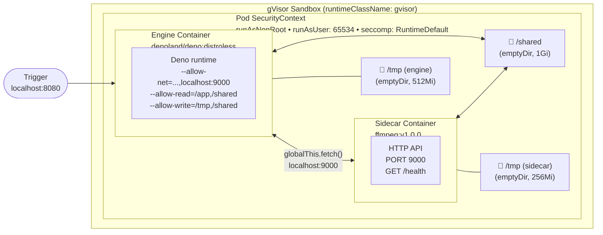

The `sidecars:` field declares auxiliary containers that run alongside the Deno engine in the same Kubernetes pod. Sidecars are declared at the top level of `workflow.yaml`, alongside `contract:`, `nodes:`, and `edges:`.

Omitting `sidecars:` entirely preserves existing behavior — no multi-container pod is generated.

## Placement in workflow.yaml

```yaml
name: my-workflow
version: "1.0"
triggers:
  - type: manual

sidecars:          # <-- top-level, alongside nodes/edges/contract
  - name: ffmpeg
    image: ghcr.io/randybias/tentacular-ffmpeg-sidecar:v1.0.0
    port: 9000

contract:
  version: "1"
  dependencies: {}

nodes:
  process:
    path: ./nodes/process.ts

edges: []

config:
  timeout: 120s
```

## Field Reference

| Field | Type | Required | Default | Description |
|-------|------|----------|---------|-------------|
| `name` | string | Yes | — | Sidecar identifier. Must match `[a-z][a-z0-9_-]*`. Must be unique within the workflow. |
| `image` | string | Yes | — | Container image reference. Pin to a digest in production. |
| `port` | integer | Yes | — | Port the sidecar HTTP/gRPC API listens on. Range: 1024–65535. Port 8080 is reserved for the engine and is rejected. |
| `protocol` | string | No | `"http"` | API protocol. Accepted values: `"http"` or `"grpc"`. |
| `healthPath` | string | No | `"/health"` | HTTP path for the readiness probe. Must return HTTP 200. |
| `command` | string[] | No | Image ENTRYPOINT | Override the container entrypoint. |
| `args` | string[] | No | Image CMD | Override the container arguments. |
| `env` | map[string]string | No | — | Environment variables to set in the sidecar container. |
| `resources.requests.cpu` | string | No | — | CPU request in Kubernetes format (e.g., `"500m"`, `"1"`). |
| `resources.requests.memory` | string | No | — | Memory request (e.g., `"256Mi"`, `"1Gi"`). |
| `resources.limits.cpu` | string | No | — | CPU limit. |
| `resources.limits.memory` | string | No | — | Memory limit. |

## Validation Rules

The spec parser enforces these rules at `tntc validate` time:

| Rule | Error |
|------|-------|
| `name` must match `[a-z][a-z0-9_-]*` | `sidecar name "%s" is invalid: must match [a-z][a-z0-9_-]*` |
| `name` must be unique per workflow | `duplicate sidecar name: "%s"` |
| `image` must not be empty | `sidecar "%s": image is required` |
| `port` must be in range 1024–65535 | `sidecar "%s": port %d is out of range (1024-65535)` |
| `port` must not be 8080 | `sidecar "%s": port 8080 is reserved for the engine` |
| `port` must be unique per workflow | `duplicate sidecar port: %d` |
| `protocol` must be `"http"` or `"grpc"` | `sidecar "%s": invalid protocol "%s" (must be "http" or "grpc")` |

## Complete Example

Full `workflow.yaml` with sidecar, contract with external dependency, multiple nodes:

```yaml
name: video-frame-extractor
version: "1.0"
description: "Fetch a video URL, extract frames via ffmpeg sidecar, analyze with AI"

triggers:
  - type: manual

sidecars:
  - name: ffmpeg
    image: ghcr.io/randybias/tentacular-ffmpeg-sidecar:v1.0.0
    port: 9000
    protocol: http
    healthPath: /health
    env:
      LOG_LEVEL: info
    resources:
      requests:
        cpu: 500m
        memory: 256Mi
      limits:
        cpu: 1000m
        memory: 512Mi

contract:
  version: "1"
  dependencies:
    openai-api:
      protocol: https
      host: api.openai.com
      port: 443
      auth:
        type: bearer-token
        secret: openai.token

nodes:
  fetch-video:
    path: ./nodes/fetch-video.ts
  extract-frames:
    path: ./nodes/extract-frames.ts
  analyze-frames:
    path: ./nodes/analyze-frames.ts

edges:
  - from: fetch-video
    to: extract-frames
  - from: extract-frames
    to: analyze-frames

config:
  timeout: 300s
  retries: 1
  fps: 1
```

## Generated Kubernetes Resources

When a workflow declares sidecars, `tntc deploy` generates a multi-container Deployment. The key additions to the pod spec:

```yaml
spec:
  runtimeClassName: gvisor
  securityContext:
    runAsNonRoot: true
    runAsUser: 65534
    seccompProfile:
      type: RuntimeDefault

  initContainers: []   # none (sidecars are regular containers, not init containers)

  containers:
  - name: engine
    image: ghcr.io/randybias/tentacular-engine:v0.7.0
    args:
      - --allow-net=api.openai.com:443,localhost:9000,0.0.0.0:8080
      - --allow-read=/app,/var/run/secrets,/shared
      - --allow-write=/tmp,/shared
    # ... (standard engine spec)
    volumeMounts:
      - name: shared
        mountPath: /shared
      - name: engine-tmp
        mountPath: /tmp

  - name: ffmpeg                    # matches sidecar.name
    image: ghcr.io/randybias/tentacular-ffmpeg-sidecar:v1.0.0
    securityContext:
      readOnlyRootFilesystem: true
      allowPrivilegeEscalation: false
      capabilities:
        drop: ["ALL"]
    resources:
      requests:
        cpu: 500m
        memory: 256Mi
      limits:
        cpu: 1000m
        memory: 512Mi
    readinessProbe:
      httpGet:
        path: /health
        port: 9000
      initialDelaySeconds: 2
      periodSeconds: 5
    volumeMounts:
      - name: shared
        mountPath: /shared
      - name: ffmpeg-tmp            # per-sidecar /tmp (automatic)
        mountPath: /tmp

  volumes:
  - name: shared
    emptyDir:
      sizeLimit: 1Gi
  - name: engine-tmp
    emptyDir:
      sizeLimit: 512Mi
  - name: ffmpeg-tmp                # one per sidecar (automatic)
    emptyDir:
      sizeLimit: 256Mi
```

Notable details:
- `localhost:9000` is added to the engine's `--allow-net` automatically
- Each sidecar gets its own `/tmp` emptyDir (required for `readOnlyRootFilesystem: true`)
- The `/shared` emptyDir is shared across all containers
- The sidecar SecurityContext matches the engine's container-level restrictions
- Pod-level SecurityContext (`runAsUser: 65534`, gVisor) applies to all containers

## Pod Architecture



Container-level SecurityContext (applied to engine and every sidecar):
- `readOnlyRootFilesystem: true`
- `allowPrivilegeEscalation: false`
- `capabilities.drop: ["ALL"]`
